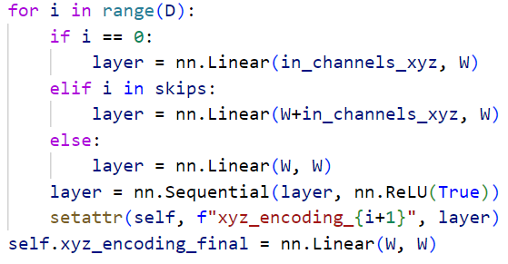
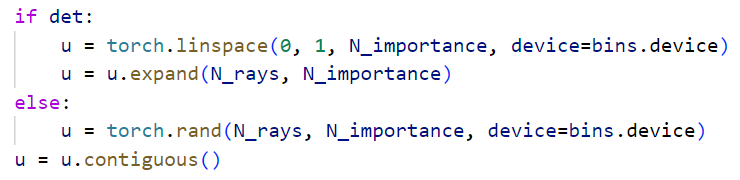

# class Embbeding(nn.Module)


最终输出的是行向量$(x,y,z,sin(x),sin(y),sin(z),cos(x),cos(y),cos(z),sin(2x),...)$

# class Nerf(nn.Module)




两段代码分别是$init$和$forward$的部分层定义。

```python
# 往类对象中加入属性name，值为value。属性不一定存在。
setattr(object, name, value)
# 从类对象中取属性name的值。
getattr(object, name)
```


得到$\sigma$用的是单独的一层网络$nn.Linear(W,1)$，其余的256个特征是由$xyz\_encoding\_final$生成的。

**sigma_only**: whether to infer sigma only. If True, x is of shape (B, self.in_channels_xyz)


在推理阶段，coarse network不需要生成color，只需要得到均匀采样后的权重PDF，根据PDF对fine network进行采样，并加上coarse network中采样的点，在fine network中计算$\sigma$和color，并进行体渲染得到最终pixel的color。所以在推理阶段，coarse network不需要预测color，only sigma is needed。

# Chunk

batchsize太大（1024条ray），每条ray又有192个采样点（64+128），数量太大，要按chunk对每个batch作切分，依次计算每个chunk的结果，最后把结果合并，得到一个batch的结果。


$defaultdict$是一种设置了默认值的dict，默认值就是参数的初始值。比如对results查询其中不存在的属性，会返回[]（空列表）。

render_ray_chunks结构

（N_importance>0）：

`{'rgb_coarse':(N_ray, 3), 'depth_coarse':(N_ray), 'opacity_coarse':(N_rays, N_samples_), 'rgb_fine':(N_ray, 3), 'depth_fine':(N_ray), 'opacity_fine':(N_rays, N_samples_)}`

（N_importance=0 and not test_time）:

`{'rgb_coarse':(N_ray, 3), 'depth_coarse':(N_ray), 'opacity_coarse':(N_rays, N_samples_)}`

（N_importance>0 and test_time）:

`{'opacity_coarse':(N_rays, N_samples_), 'rgb_fine':(N_ray, 3), 'depth_fine':(N_ray), 'opacity_fine':(N_rays, N_samples_)}`

所以result存储的是在每次chunk中不断扩增对应字段组成的列表。

最终 `result[k] = torch.cat(v,0)`是在N_ray维度进行连接，合成batch的信息。

# Render_rays

每次渲染chunk条ray，并返回每条ray的color，depth和权重。


采用两种方式做均匀采样：

- 对z分量进行等距采样（near, far都是z值）
- 对视差进行等距采样（对于同一个z值，视差是相同的）


$$
d = \frac{fT_x}{z}
$$
当z不变时，d不变（相似三角形）。当z增大时，d减小。


右侧就是在z轴空间均匀采样的结果，左侧是在视差空间里均匀采样的结果。可以看到，z轴均匀采样，在数值上确实是等距的，但是从人眼的视差效果来看，它们并不等距。视差空间均匀采样可以让人眼在视觉效果上等距，但实际上它们并不等距（距离越远，间距越大）。


对采样点（z值）做扰动（随机性增强鲁棒），perturb=1就是下面的效果：


得到所有course network采样点的xyz坐标。这里利用了广播机制：

`(N_ray, 1, 3) + (N_ray, 1, 3) * (N_ray, N_samples, 1) = (N_ray, N_samples, 3)`


如果是 `test time`，就只计算权重的预测（fine network需要），否则在训练阶段，仍然需要预测color,depth和weights。

`weights_coarse.sum(1)`是对光线上的所有采样点做求和，表示穿过这条光线的场景的不透明度（吸收的能量）


> 对于coarse network和fine network中采样点位置的确定，抱有疑惑：为什么t的值可以用d的值代替？`rays.d`是单位向量但是在z分量上的值不为1。

对fine network做采样，通过sample_pdf得到新的采样点的z值，并和之前coarse network上采样到的点进行cat和sort，得到最终的采样点（N_samples + N_importances）。

对于fine network无论如何都要预测color,depth和weights。

# Render_rays inference


`torch.repeat_interleave`是在固定维度上每个值repeat，与 `'torch.repeat'`不同。比如对于[1,2,3]按照维度1，前者就是[1,1,2,2,3,3]，后者就是[1,2,3,1,2,3]

这里 `if not weights_only`的意思就是，如果只需要weight（比如test time下的coarse network），那么dir_embedded根本没有作用，也就不需要后续处理。


同样因为显存的原因，采用了chunk的操作。最后用cat把所有结果合并。`(N_rays,N_samples) or (N_rays,N_samples,4)`

接下来就是体渲染的部分：


求出每条ray每个采样点之间的间隔，每个采样点的属性象征它后面那段间隔的属性（所以积分才能变求和）

但是最后一个采样点它后面的间隔无法计算，所以给予一个固定值 `1e10`，并把它合并到最终的 `deltas`里


`dir_`的维度是$(N\_rays,1,3)$，求norm之后得到的维度是 `(N_rays,1)`。 `deltas`的维度是$(N\_ray,N\_samples\_)$。经过广播之后得到最终的维度是 `(N_rays,N_samples)`。

> 这里对 `deltas = deltas * torch.norm(dir_.unsqueeze(1),dim=-1)`的方式存疑：
>
> 从 `ray_utils.py`中，`get_rays`函数返回的 `rays.d`本身就是单位向量。经过 `norm`之后就是1，与deltas相乘并不能得到真实世界里的距离。个人建议修改为（尚未验证）：
>
> `deltas = torch.norm(deltas.unsqueeze(-1) * (dir_/dir_[:,-1:]).unsqueeze(1), dim=-1)`

`noise`是对每个采样点的$\sigma$的扰动。

`relu(sigmas+noise)`是为了确保体密度是正值。 `alphas`代表每条光线每个采样点后边那段间隔吸收光线的程度。


alphas_shifted得到的结果是：

$$
\left[\begin{matrix}1&1-a_{11}+10^{-10}&1-a_{12}+10^{-10}&...\\ 1&1-a_{21}+10^{-10}&1-a_{22}+10^{-10}&...\\ 1&...\\ 
1&...&&1-a_{nm}+10^{-10}\end{matrix}\right]
$$

经过 `torch.cumprod`后（记$1-a_{11}+10^{-10} = b_{11}$）：

$$
\left[\begin{matrix}1&b_{11}&b_{11}b_{12}&...&b_{11}...b_{1m}\\ 1&b_{21}&b_{21}b_{22}&...&b_{21}...b_{2m}\\ ...&...&...&...&...\\ 1&b_{n1}&b_{n1}b_{n2}&...&b_{n1}...b_{nm}\end{matrix}\right]
$$

所以最终的weights为：

$$
\left[\begin{matrix}a_{11}&a_{12}b_{11}&a_{13}b_{11}b_{12}&...&a_{1m}b_{11}...b_{1m-1}\\ a_{21}&a_{22}b_{21}&a_{23}b_{21}b_{22}&...&a_{2m}b_{21}...b_{2m-1}\\ ...&...&...&...&...\\ a_{n1}&a_{n2}b_{n1}&a_{n3}b_{n1}b_{n2}&...&a_{nm}b_{n1}...b_{nm-1}\end{matrix}\right]
$$

其中$a_{ij}$为第i条光线第j个采样点处的不透明度（吸收能量的比例），$b_{ij}$为第i条光线第j个采样点处的透射度（光线能量穿过的比例）为其公式为：

$$
a_{ij} = 1-e^{-\delta_{ij}(\sigma_{ij}+noise_{ij})},\\
b_{ij} = 1-a_{ij}+10^{-10}.
$$

这个权重的含义是：一条光线在到达某个采样点之前已经会有能量损耗，原因就在于采样点前面的采样点会吸收光线的部分能量，透射部分的能量。那么对于$Sample_{ij}$来说，光线$ray_{i}$在抵达这个点前，只剩下原来能量的$b_{i1}b_{i2}...b_{ij-1}$倍，在这个点上又被吸收$a_{ij}$比例的能量，所以光线$ray_i$被$Sample_{ij}$吸收能量的比例就是$a_{ij}b_{i1}b_{i2}...b_{ij-1}$。**所以权重就是光线被吸收的比例，权重越大，吸收比例越大，颜色占比越多。**

`weights_sum`表示射线穿进这个场景后被吸收了多少比例的能量。

利用 `weights`可以对每条射线上的采样点的颜色和深度进行加权求和，得到每条射线最终的渲染颜色和深度。


`white_back`的作用是让没穿过任何物体的射线赋予最高能量$(1,1,1)$，也就是白色。

`1-weights_sum.unsqueeze(-1)`代表射线未被吸收的能量比例，这些能量最终透过场景，打到无限远，打到一堵能量最高的白墙上。这里就是假设无限远处有一堵能量最高的白墙。

# Sample_pdf


根据coarse network中采样点的weights，得到每条射线相应的pdf，进而算出cdf（递增）。

每条射线的第一个采样点和最后一个采样点不考虑，因为第一个采样点在cdf中的值默认是0，而最后一个采样点所对应的间隔是无穷远，不可能纳入fine network采样的范围。

`bins`在这里是采样点间距的中点集合，个数是$N_samples-1$。但是函数里的$N\_samples$比正常的$N\_samples$小2，所以在函数参数说明里是$N\_samples+1$。




如果coarse network中的采样点没有做扰动，那就让u等间距均匀采样。但是如果采样点有做扰动，那就随机采样。


原因就在于，做扰动的采样点之间不是等距的，所以对应的bins的长度就不一致，如果还是对u做均匀采样的话，就会导致上图的结果：权重差不是最大的bin（第一个）由于自身bin间隔较短，却成为了采样最密集的地方。


`searchsorted`函数用来求插值索引：

> searchsorted()是查找数组元素时，经常用到的函数。查找一个合适的位置，将元素插入已排好序的一维数组中，并且保持数组元素的顺序不被打乱。

`side`参数用来确定方向：`left`找到第一个小于等于查询数的索引；`right`找到第一个大于等于查询数的索引。

这时 `inds`的维数与 `u`相同，是$(N_{ray},N_{importance})$。

`below`和 `above`是为了找到u值在cdf函数中的索引区间：


clamp是为了防止异常值。


`torch.stack([below,above], -1)`求的维度是$(N_{rays},N_{importance},2)$，是将 `below`和 `above`中各取一个值作为第一个维度，这个维度就代表着每一根射线上每一个新采样的点的索引范围$(below,above)$。通过 `view`更换形状后，第一维度就代表着每根射线上所有新采样点的索引范围（按顺序排好）:

$$
(below_1,above_1,below_2,above_2,...)
$$

对于 `torch.gather`，可以看作一个索引替换函数。

`torch.gather(input, dim, index, out=None) → Tensor`

首先，函数要求**input和index必须拥有相同的dimension**，于是index的索引与input的索引值在维数上是一样的。

index存储的值就是对自己索引某个值的替换，具体替换哪个值取决于dim的数值。将替换后的索引作为最终的索引在input中取数，就得到了最终的结果。

所以可以看到，**output和index的shape是一样的**。

举个例子：

input和index的维数都是三维，索引拥有$(i,j,k)$的形式。对于index上的某个索引$(1,2,3)$，$index[1][2][3]$=2。假设$dim=0$，说明要将第0维进行替换，而替换的值就是index对应索引处的值，这里就是将2替换1，得到最终索引$(2,2,3)$，所以$output[1][2][3]=input[2][2][3]$。

`cdf_g`和 `bins_g`都是利用 `inds_sampled`作为索引，所以拥有相同的形状$(N_{rays},2\times N_{importance})$。 `inds_sampled`的索引$(i,j)$代表第$i$根射线上第$j/2$个新采样点的索引范围（$j$是奇数就是below，$j$是偶数就是above）。这里dim=1，所以就是将索引范围替换$j$，并去 `cdf`和 `bins`里面取值。最终得到的结果代表：

- `cdf_g`：第$i$根射线中第$j$个新采样点在哪两个cdf值之间（$cdf[i][j][0]$代表较低的cdf，$cdf[i][j][1]$代表较高的cdf）
- `bins_g`：第$i$根射线中第$j$个新采样点在哪两个旧采样中间z值之间（输入函数的bins是coarse network中相邻旧采样点的中间z值）（$bins[i][j][0]$代表较低的z值，$bins[i][j][1]$代表较高的z值）。在第$i$个和第$j$个中间z值之间，就是在第$j$个旧采样点的扰动范围之内，这里$j$的范围是$(1,N\_samples\_)=(1,N\_sample-2)$，少了第0，倒二和倒一三个旧采样点的扰动范围。

两个结果的维度都是$(N_{rays},N_{importance},2)$。

`denom`代表相邻两个bins之间cdf的差。如果差值为0，说明相邻bins之间没有物体，没有吸收能量。在u做采样时，也不会采样到这两个bins之间（因为它们没有差值）。为了从代码上保证分母不为0，对于这种情况，给它随意赋值（代码中赋值1）（但其实没有这行代码也行，因为 `searchsorted`和 `inds-1`作为below的操作保证了cdf差值为0的相邻bins之间不可能采到样）。


最后一行代码做的是对bins_below和bins_above的线性插值：

$$
sample = bins_{below} + k(bins_{above}-bins_{below}),\\
k= \frac{u-cdf_{below}}{cdf_{above}-cdf_{below}}.
$$

根据在$cdf_{below}$和$cdf_{above}$中的比例，成比例的在$bins_{below}$和$bins_{above}$中插值。返回值维度为$(N_{rays},N_{importance})$

注意，$bins$和$sample$都是z值，并不是真正的采样点在世界3D中的坐标。后续还需要进一步转换：


